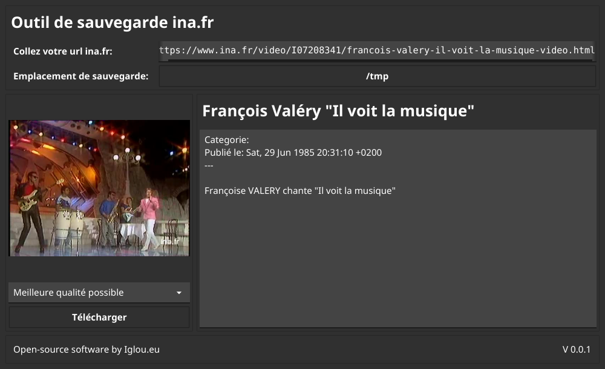

#  Ina backup tool (inadl)

[](https://opensource.org/licenses/MIT)
[](https://goreportcard.com/report/git.iglou.eu/adrien/inadl)

> Ina backup tool is written in Go   
Current version **0.0.1** (03/2021)

:page_with_curl: **DESCRIPTION** 
---
Inadl is a simple backup downloader tools for ina.fr    
It's working properly for direct video url like :
- ```https://www.ina.fr/video/PUB232175070```
- ```https://www.ina.fr/video/PUB232175070/playstation-lancement-video.html```

Other URL support coming soon

:rocket: **HOW TO** 
---
Go to https://www.ina.fr and select a video.   
Copy and paste URL, select an output directory and click on Download button. That's it.   

 

:construction: **INSTALLATION** 
---
Download latest executable:   
https://git.iglou.eu/adrien/inadl/releases

**Or**

Install with Go:   
 `go install git.iglou.eu/adrien/inadl@latest`

:interrobang: **FAQ** 
---
**When I should use this program ?**

- Bad Internet connections  
- No Internet connections (Travelling ?)  
- Poor power or Old computer  

**Why Ina ?**
   
* My computer is old and Ina.fr is very slow on it
* Ina.fr don't provide any possibility for a local usage of there video
* The content of Ina.fr is historical and made with the French population taxes

:blowfish: **DISCLAIMER** 
-------
This program is for personal use only. You alone have the responsability for any usage which could be against Ina.fr privacy policy.

> *Tous droits de reproduction et de diffusion réservés © 2018 Institut national de l'audiovisuel*     
> *Ina - Institut national de l'audiovisuel, 4 avenue de l'Europe - 94366 Bry-sur-Marne cedex*

----------